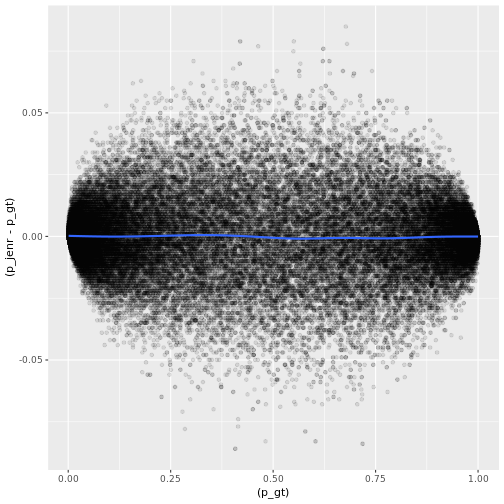
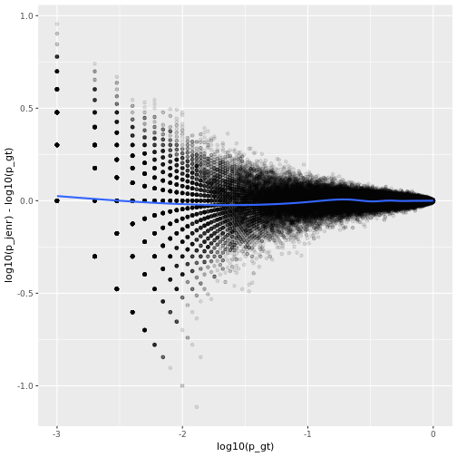
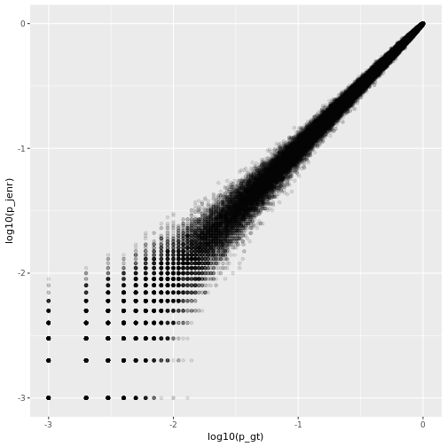

# HistoCat comparison

This directly compares results from this implementation with HistoCAT results


```r
library(neighbouRhood)
library(data.table)
library(dplyr)
library(magrittr)
library(dtplyr)
library(ggplot2)
library(parallel)
```
These files contains data neightbourhood permutation test results exported from HistoCAT

```r
fn_cell = '/mnt/bbvolume/server_homes/janaf/Data/2018/NeighborhoodVito/20180727_celldata.csv'
fn_rel = '/mnt/bbvolume/server_homes/janaf/Data/2018/NeighborhoodVito/20180727_reldata.csv'
```

```r
dat_cell = fread(fn_cell)

dat_relation = fread(fn_rel)

dat_relation[, `First Object Name` := 'cell']
dat_relation[, `Second Object Name` := 'cell']
dat_relation[, `Relationship` := 'Neighbors']
```


```r
d = prepare_tables(dat_cell, dat_relation, col_label = 'CellType', objname = 'cell', col_group = NULL)


dat_baseline = apply_labels(d[[1]], d[[2]]) %>%
  aggregate_histo()
```


```r
nperm = 1000
```


```r
start_time <- Sys.time()

dat_perm = mclapply(1:nperm, function(x){
   shuffle_labels(d[[1]]) %>%
     apply_labels(d[[2]]) %>%
    aggregate_histo()
},mc.cores = 16, mc.cleanup=T
) %>%
  rbindlist(idcol = 'run') 
end_time <- Sys.time()
print(end_time - start_time)
```

```
## Time difference of 3.994541 mins
```


```r
start_time <- Sys.time()
dat_p <- calc_p_vals(dat_baseline, dat_perm, n_perm = nperm) 
end_time <- Sys.time()
print(end_time - start_time)
```

```
## Time difference of 50.43581 secs
```


```r
fn_enr = '/mnt/bbvolume/server_homes/janaf/Data/2018/NeighborhoodVito/PvalsNicolasData_enrichment.csv'
fn_avoid = '/mnt/bbvolume/server_homes/janaf/Data/2018/NeighborhoodVito/PvalsNicolasData_avoidence.csv'

dat_j_enr = fread(fn_enr)
dat_j_avoid = fread(fn_avoid)
```


```r
setnames(dat_j_enr, c('CellType2new', 'CellType1new', 'Pvalue'),  c( 'FirstLabel', 'SecondLabel', 'p_jenr'))
setnames(dat_j_avoid, c('CellType2new', 'CellType1new', 'Pvalue'),  c( 'FirstLabel', 'SecondLabel', 'p_javoid'))
```


```r
dat =dat_p %>%
  mutate(ImageNumber= group) %>%
  merge(dat_j_enr, all=T, by= c('ImageNumber','FirstLabel', 'SecondLabel')) %>%
  merge(dat_j_avoid, all=T,  by= c('ImageNumber','FirstLabel', 'SecondLabel'))
```


```r
dat[is.na(p_gt), p_gt:=1]
dat[is.na(p_lt), p_lt:=1]
```


```r
ggplot(dat, aes(x=(p_gt), y=(p_jenr)))+
  geom_point(alpha=0.1)
```


```r
ggplot(dat, aes(x=(p_gt), y=(p_jenr-p_gt)))+
  geom_point(alpha=0.1)+
  geom_smooth()
```

```
## `geom_smooth()` using method = 'gam' and formula 'y ~ s(x, bs = "cs")'
```




```r
ggplot(dat, aes(x=log10(p_gt), y=log10(p_jenr)-log10(p_gt)))+
  geom_point(alpha=0.1)+
  geom_smooth()
```

```
## `geom_smooth()` using method = 'gam' and formula 'y ~ s(x, bs = "cs")'
```




```r
lm( p_gt ~ p_jenr, dat)
```

```
## 
## Call:
## lm(formula = p_gt ~ p_jenr, data = dat)
## 
## Coefficients:
## (Intercept)       p_jenr  
##   0.0003162    0.9995955
```


```r
ggplot(dat, aes(x=log10(p_gt), y=log10(p_jenr)))+
  geom_point(alpha=0.1) +
  coord_equal()
```




