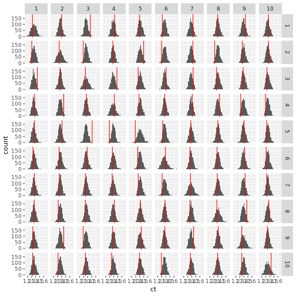
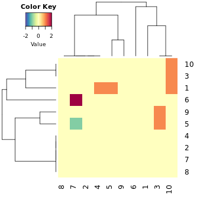

```r
library(data.table)
library(dplyr)
library(magrittr)
library(dtplyr)
library(ggplot2)
library(parallel)
library(neighbouRhood)
library(gplots)
library(RColorBrewer)
```
# This describes the neighbouRhood analysis

This code aims to reproduce the neightbouRhood analysis as implemented in the HistoCAT paper.

## Requirements
It needs two tables:
- an object table: an object-level table, e.g. extedned from CellProfiler, that contains a column with an imagenumber, a column with an objectnumber and a column with the label (eg cluster id) that should be used for the permutation testing
- a neightbourhood graph table: a table that encodes the object relationships, eg the 'Object relationships' table from CellProfiler. Currently the columns need to be:
  'First Object Name', 'First Image Number', 'First Object Number', 'Second Image Number', 'Second Object Name', 'Second Object Number'
  (default Cellprofiler naming)

## Concept
This package has several steps:

1) Use the `prepare_tables` function to combine the objects and relationships table into a standardized more efficiently manipulatable format, check `?prepare_tables` for details.

   Important arguments:
    - dat_obj: the object data
    - dat_rel: the neightbourhood graph data
    - objname: the `ObjectName` assigned by cellprofiler
    - col_group: Over which entities should the permutation test be performed? Default: the Image column. This can be used to e.g. do the permutation test over all images from a patient
      instead of per image.

2) Apply the current labels to cells using `apply_labels` and calculate the baseline statistics using the statistics aggregation function of interest using an `aggregate_*` function.

   Currently two aggregation statistics are implemented:
    - `aggregate_classic`: How many neightbours of type B does a cell of type A have on average?
    - `aggregate_histo`: How many many neightbours of type B has a cell of type A on average, given it has at least one neigthbour of type B? 
    - `aggregate_classic_patch`: What fraction of cells of type A have at least a given number of neighbours of type B?
    
    Check the documentation to see the differences between the two.
    
    These aggregation statistics return 3 columns: Firstlabel, SecondLabel, ct (=calculated statistics)
    
3) Repeatidly permute the lables using `shuffle_labels`, apply them using `apply_labels` and calculate the statistics for the randomized data using the same `aggregate_*` function.

   Use `data.table::rbindlist` to collate aggregation statistics from different runs

4) Calculate p-values using the baseline statistics, the permutation statistics and the number of permutations using `calc_p_vals`


# Example

## Specify the input

This example uses example cellprofiler output and assignes random labels.

Note that the number of permuatitions (n_perm) should likely be increased for a serious analysis.

```r
# path to a (potentially modified) cellprofiller like object measurements file
fn_cells = system.file("extdata", "cell.csv", package = "neighbouRhood", mustWork = TRUE)
# path to the Object relationships
fn_relationship = system.file("extdata", "Object relationships.csv", package = "neighbouRhood", mustWork = TRUE)

n_perm = 1000

# Number of cores used for multicore:
ncores=10
```

## Start the analysis

### 0) Load and prepare

```r
dat_cells = fread(fn_cells)
dat_relation = fread(fn_relationship)
```


Here we assign random lables. In a real example the label should eg be a cluster number

```r
dat_cells[, label := sample.int(10, size=.N, replace = T)]
dat_cells[, group := ImageNumber]
```


### 1) Prepare the data


```r
d = prepare_tables(dat_cells, dat_relation)
```

### 2) Calculate the baseline statistics

```r
dat_baseline = apply_labels(d[[1]], d[[2]]) %>%
  aggregate_histo()
```


### 3) Calculate the permutation statistics 

This will run the test using parallel computing.
The name of the idcol does actually not matter.

```r
set.seed(12312)
dat_perm = rbindlist(mclapply(1:n_perm, function(x){
  dat_labels = shuffle_labels(d[[1]])
  apply_labels(dat_labels, d[[2]]) %>%
    aggregate_histo()
},mc.cores = ncores
), idcol = 'run') 
```

### Optional 3b)
Visualize the distribution of the statistics in the permutations vs the observed baseline (red).
For large datasets this might be really slow.

```r
ggplot(dat_perm %>% filter(group==1), aes(x=ct)) +
  facet_grid(FirstLabel~SecondLabel)+
  geom_histogram() +
  geom_vline(data=dat_baseline%>% filter(group==1),aes(xintercept=ct), color='red')
#> `stat_bin()` using `bins = 30`. Pick better value with `binwidth`.
```



### 4) Calculate the p-values

```r
dat_p <- calc_p_vals(dat_baseline, dat_perm, n_perm = 1000, p_tresh = 0.01) 
```

### Varia: Some data visualisation

### a) Generate a heatmap of the number of significant interactions for the labels.

Note that we just sum over the signed significant boolean (-1 or 1).
If an interaction comes as both significant avoiding as well as interacting, these will just cancel each other out.

Prepare the data

```r


pmat = dcast(dat_p, 'FirstLabel ~ SecondLabel', value.var = 'sigval', fun.aggregate = sum,
             fill=0, drop=F)

rname = pmat$FirstLabel

pmat = pmat %>%
  select(-c('FirstLabel')) %>%
  as.matrix()

row.names(pmat) <- rname
```

Plot the heatmap

```r

cols = rev(brewer.pal(11,'Spectral'))
cmap = colorRampPalette(cols)


hr <- hclust(dist(pmat), method="ward.D")
heatmap.2(pmat,
          Colv = as.dendrogram(hr),
          Rowv = as.dendrogram(hr),
          trace = "none",
          col=cmap(75),
          density.info ='none'
          #comments = data.frame(names = row.names(tab_Prot))
)
```




